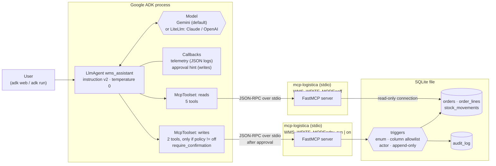

# adk-wms-assistant: a Google ADK warehouse assistant that asks before assuming

A small warehouse assistant built with the
[Google Agent Development Kit](https://google.github.io/adk-docs/) (`google-adk`).
It has no tools of its own. It uses the tools of
[`mcp-logistica`](https://github.com/noelaliaga/mcp-logistica), an MCP server
for a warehouse management system (WMS), through ADK's `McpToolset` over stdio.

- **Ask before assuming.** The instruction tells the model to ask which
  order, SKU or status the user means instead of picking one. The server
  enforces the same rule: a name is never enough to choose which order to
  write to.
- **Writes are off by default.** With writes on, **every write waits for a
  person to approve it**, and the approval prompt shows the exact call.
- **Gemini by default, Claude or OpenAI through LiteLLM**, chosen with an
  environment variable.
- **Structured telemetry** for every tool call and model response, tagged
  with the instruction version.

Python 3.11–3.14, `google-adk` 2.9, the official `mcp` SDK, `mypy --strict`,
`ruff`, `pytest`, GitHub Actions. All data is synthetic.

> **Honest status:** tested offline with a scripted model against the real
> MCP server (52 tests). **Not run against a real model yet, and not
> deployed.** See [Status](#status).

## Try it in 60 seconds (no API keys)

```bash
git clone https://github.com/noelaliaga/mcp-logistica ../mcp-logistica   # needs access while that repo is private
make install        # python3 >= 3.11; or PYTHON=python3.12, or PYTHON="$(uv python find 3.12)"
make seed           # data/wms.sqlite with synthetic orders and stock
make test           # 52 tests: scripted model, real MCP server, no network
make eval-offline   # ADK's evaluator on the eval set with a replayed agent
```

`make eval-offline` checks that the eval files, tool names and metrics work
with ADK. It **does not measure model quality**. After the results it prints
a `ConnectionError: MCP session connection lost` traceback. That is expected
with ADK 2.9.1 (see [testing notes](docs/testing-notes.md)).

**Where to read the code first:**

1. [`test_a_write_waits_for_user_approval`](tests/test_agent_turns.py): the
   write pauses, nothing changes, and the approval prompt names the order,
   status and reason.
2. [`test_the_server_still_refuses_a_forbidden_status_after_approval`](tests/test_agent_turns.py):
   the user approves marking an order `shipped`, and the server still refuses.
3. [`test_adk_evaluator_fails_an_agent_that_guesses`](tests/test_evalset.py):
   a negative control for "asks before assuming".
4. [`toolsets.py`](agents/wms_assistant/toolsets.py) and
   [`approval.py`](agents/wms_assistant/approval.py): how reads and writes are
   separated, and how approval is requested.

## The problem

A WMS assistant is useful when it can answer "which orders are stuck?" or
"where is SKU X?" in seconds. It is dangerous when it answers confidently
and is wrong:

- "Martínez's order" matches four orders, and the assistant reports one of them.
- "TDW-GLV" is not a SKU, and the assistant reports the stock of the closest match.
- "Mark it shipped" gets written because the model sounded sure.

`mcp-logistica` makes those mistakes impossible to *write*. This repository
covers the layer above: an ADK agent whose configuration, instruction and
approval flow push the model to **ask**, with tests that prove the wiring.

## Architecture



| Piece | File | What it does |
|---|---|---|
| Settings | [`config.py`](agents/wms_assistant/config.py) | Reads the `WMS_*` variables. Unknown backends, policies and timeouts, and a `provider/model` id on the Gemini backend, abort with a clear error |
| Instruction | [`prompts.py`](agents/wms_assistant/prompts.py) | Versioned system instruction (`adk-wms-assistant/v2`, [changelog](PROMPT_CHANGELOG.md)), read-only or write variant |
| Toolsets | [`toolsets.py`](agents/wms_assistant/toolsets.py) | Two `McpToolset`s, each with its own server process, tool filter and environment |
| Approval | [`approval.py`](agents/wms_assistant/approval.py) | Requests confirmation for writes with the full call in the hint |
| Telemetry | [`telemetry.py`](agents/wms_assistant/telemetry.py) | One JSON log line per tool call (duration, outcome) and per model response (tokens) |
| Agent | [`factory.py`](agents/wms_assistant/factory.py) | Builds the `LlmAgent`; picks Gemini or `LiteLlm`; wires the callbacks |
| Eval metrics | [`eval_metrics.py`](agents/wms_assistant/eval_metrics.py) | Two deterministic ADK custom metrics (no judge) |
| Eval set | [`evals/`](evals/) | ADK eval set and metric configs |
| Deployment guide | [`docs/deploy-vertex-agent-engine.md`](docs/deploy-vertex-agent-engine.md) | Vertex AI Agent Engine steps, **not executed** |

The tools come from the server: `find_orders`, `get_order`,
`list_stalled_orders`, `get_stock`, `get_audit_log` (reads) and
`set_order_status`, `add_order_note` (writes).

## Decisions

**MCP instead of Python function tools.** ADK can turn a Python function
into a tool, and that would have meant less code here. The tools live behind
MCP so that other clients can use the same server unchanged: this agent, any
stdio MCP client, and the LiteLLM evaluation harnesses. The rules (closed
status list, column allowlist, "a name never selects a write target", audit
by trigger) are written and tested once, in the server and the database. The
cost is a process boundary and a dependency on the server's tool names. A test
lists the server's tools, so a new tool fails CI until someone decides whether
the agent should get it.

**Two toolsets and two server processes, not one toolset plus a filter
callback.** The read toolset always starts the server with
`WMS_WRITE_MODE=off`, so even a wrong filter cannot write. The write toolset
exists only when the policy allows writes. It keeps
`require_confirmation=True`, so removing the approval callback falls back to
ADK's generic prompt, never to an unconfirmed write. A `before_tool_callback`
filter alone would put all the safety in one piece of Python.

**Approval shows the call.** ADK's `McpTool` asks with a generic text, and
`adk run` prints only that text. `approval.py` requests the confirmation
first, with a hint like:

```text
Approve this write? set_order_status(order_ref='10432', reason='Only 1 unit of TDW-GLV-L at A-02-01; order needs 3', status='stock_issue'). Mode on: the change is committed and audited as 'agent'.
```

A test checks that hint. The server stops invalid writes; only the person
who asked can stop a *valid* write to the wrong order.

**Model keys never reach the server.** The MCP SDK passes a small safe set of
variables (HOME, PATH, ...) plus what the toolset adds: `WMS_DB_PATH`,
`WMS_WRITE_MODE` and, when set, `PYTHONPATH`. A test starts the real servers
with a probe command and checks the environment they actually received.

**Telemetry without content.** Tool calls log name, argument *names*,
duration and outcome (`ok`, `needs_clarification`, `dry_run`,
`approval_requested`, `rejected`, `server_error`). Model responses log token
counts and the number of tool calls. Every line carries the instruction
version. Argument values and message text are not logged because they can
contain customer names.

**Gemini by default, LiteLLM for the rest.** Gemini is ADK's native path.
Claude and OpenAI go through ADK's `LiteLlm` wrapper, so switching provider is
a configuration change:

```bash
WMS_MODEL_BACKEND=litellm WMS_MODEL=anthropic/<model-id> make run
```

The default Gemini model is ADK's own (`LlmAgent.DEFAULT_MODEL`), so it
follows the installed ADK version.

**`mcp-logistica` is not a declared dependency.** It is not on PyPI, and
declaring an unpublished name invites dependency confusion. `make install`
installs it explicitly from `MCP_LOGISTICA` (a local path or a git URL).

**Temperature 0.** It removes one source of variation. It does not make a
model deterministic, so comparing two instruction versions still needs
several runs each.

## Run it with a model (your own credentials)

Copy [`.env.example`](.env.example) to `.env` or export the variables. Then:

```bash
make web                      # ADK dev UI; writes off. Opens without keys, answers only with them
make run POLICY=dry_run       # terminal chat; writes need approval and are rolled back
make run POLICY=on            # writes need approval and are committed (audited as 'agent')
```

| Variable | Default | Values |
|---|---|---|
| `WMS_MODEL_BACKEND` | `gemini` | `gemini`, `litellm` |
| `WMS_MODEL` | ADK's default Gemini model | a Gemini id, or `provider/model` for LiteLLM |
| `WMS_WRITE_POLICY` | `off` | `off`, `dry_run`, `on` |
| `WMS_DB_PATH` | `data/wms.sqlite` | a database created by `wms-seed`; a missing file stops the agent at import |
| `WMS_MCP_COMMAND` | this Python with `-m wms_mcp.server` | any command that starts the server on stdio |
| `WMS_MCP_TIMEOUT_S` | `30` | seconds, `(0, 600]` |

With `make`, `POLICY=...` and `DB=...` on the command line win over `.env`.
Without them, `.env` or your shell decides.

Telemetry lines go wherever ADK sends logs at its default INFO level. `adk web`
prints them to the console. `adk run` writes them to the log file it names at
startup.

These commands call a paid model API. They have **not** been run for this
repository yet.

## Evaluate

[`evals/wms_assistant.test.json`](evals/wms_assistant.test.json) is an ADK eval
set with eight cases, run with writes off: stalled orders, stock per location,
a partial SKU, an ambiguous customer name, the same name followed by the
user's answer (two turns), a write request with writes disabled, an order
note with a prompt injection, and an audit trail. Reference answers are
hand-written against the seed data.

Which metric covers which behaviour:

| Behaviour | Metric | Judge? |
|---|---|---|
| Calls the right tools with the right arguments, in order | `tool_trajectory_avg_score` (`IN_ORDER`) | no |
| Calls no tool the reference does not call (an empty reference allows none; `IN_ORDER` passes it) | `no_tool_calls_beyond_reference` (custom) | no |
| Asks when the reference asks | `asks_when_reference_asks` (custom, crude "?" check) | no |
| After the user picks an id, acts on that id | trajectory on the two-turn case | no |
| Wording close to the reference | `response_match_score` (ROUGE-1) | no |
| Asks *instead of choosing*, no invented facts, ignores injected text | `rubric_based_final_response_quality_v1` | **yes** |

Only the rubric judge can tell a good clarifying question from a bad one.
The deterministic metrics catch the obvious failures cheaply.

```bash
make eval-offline   # replayed agent, deterministic metrics only, no keys
make eval           # your model + Gemini judge, paid (procedure: docs/live-runs.md)
```

- `make eval` needs **Google credentials for the judge** even when the agent
  runs on Claude or OpenAI.
- The judge is pinned in `evals/test_config.json` (`gemini-3.5-flash`). The
  id has not been checked against the live API. A Gemini judge grading a
  Gemini agent may favour its own family. [docs/live-runs.md](docs/live-runs.md)
  explains how to change it and what to record.
- The thresholds are starting points, not calibrated values. The trajectory
  metric compares arguments exactly. A model that omits `min_hours=48` fails
  it while giving the right answer.
- A manual [`eval-live`](.github/workflows/eval-live.yml) workflow runs the
  same command with repository secrets and uploads the log. It has not been
  run.

**No live results are included.** The companion repository
[`wms-agent-evals`](https://github.com/noelaliaga/wms-agent-evals) is a
harness for comparing models on the same tools. Its offline pipeline is
tested, but it has no live results published yet.

## Tests

The test process cannot open network connections or resolve names. The MCP
servers are child processes on pipes. The model is
[`ScriptedLlm`](tests/fakes.py), a real `BaseLlm` subclass that returns
scripted turns. ADK builds the real request and runs the returned function
calls through the real toolsets, server and SQLite triggers. Only the model's
choices are fake.

| File | What it checks |
|---|---|
| `test_config.py` | Defaults; closed vocabularies; LiteLLM needs a prefixed id; a LiteLLM id on the Gemini backend is rejected; network and DNS are blocked |
| `test_agent_build.py` | Model choice; temperature 0; instruction variant; toolsets, filters and `require_confirmation`; the read server always gets `WMS_WRITE_MODE=off`; `root_agent` loads through the `adk web`/`run`/`eval` loaders |
| `test_server_env_end_to_end.py` | The real server processes receive no model keys (probe command) |
| `test_toolset_stdio.py` | `McpToolset` starts the server over stdio and lists exactly the expected tools; schemas come from the server |
| `test_agent_turns.py` | A read turn; an ambiguous name returns candidates; a write waits for approval, and the **hint shows the call**; rejected, approved, dry-run and forbidden (`shipped`) writes; **telemetry** lines and outcomes |
| `test_litellm_turn.py` | A tool-call round trip through ADK's `LiteLlm` adapter with a stub client (OpenAI format): tool declarations, JSON-string arguments, tool result message |
| `test_evalset.py` | Eval files validate; ADK's evaluator passes a replay; three negative controls fail the metric they target (no tools, guessing, extra tool calls) |

## Status

**Tested locally** on 2026-09-16 (macOS). Details and versions are in
[docs/testing-notes.md](docs/testing-notes.md).

- `pytest`: 52 passed on each of Python 3.11, 3.12, 3.13 and 3.14.
- `ruff check`, `ruff format --check` and `mypy --strict` are clean.
- `make eval-offline`: 8 of 8 cases pass.
- The workflow files pass `actionlint` 1.7.12.

**Configured but never run:** GitHub Actions (`ci.yml`, Python 3.11–3.14,
and the manual `eval-live.yml`). CI checks out `mcp-logistica` at a pinned
commit and needs a read token while that repository is private.

**Not done:**

- **No run against a real model.** Nothing has called Gemini, Claude or
  OpenAI, so how well a real model follows "ask before assuming" is **not
  measured**. [docs/live-runs.md](docs/live-runs.md) is the procedure.
- **Not deployed.** The [deployment guide](docs/deploy-vertex-agent-engine.md)
  was written from the CLI's help and source. None of its steps were run.
- `adk run` was not used with a model. `adk web` starts and lists the agent
  without keys, but it cannot answer.

## Limitations

- **The scripted model ignores tool results.** The offline tests check wiring
  and safety configuration, not reasoning.
- **Provider schema acceptance is untested.** ADK sends MCP schemas as JSON
  Schema (`anyOf`/`null`, `additionalProperties: false`), and LiteLLM
  forwards them. Whether each provider accepts them, and whether chained
  Gemini calls need anything extra, only a live run will show.
- **Approval is only as good as the client.** ADK pauses and emits
  `adk_request_confirmation`. `adk web` and `adk run` show it; a custom
  client must show it too, or writes never happen.
- **Approval is per call.** A careless "yes" still writes a valid but wrong
  change. The audit log records it; it does not prevent it.
- **stdio and SQLite.** Fine for a local assistant. A shared deployment needs
  the MCP server as an authenticated HTTP service in front of a real database.
- **Small synthetic eval set** (eight cases, writes off). Write paths are
  covered by pytest and by `mcp-logistica`'s own scenarios.
- **Instruction not tuned against a model.** v2 changed the text after code
  review, not after a measured failure ([changelog](PROMPT_CHANGELOG.md)).
- **ADK moves fast.** `google-adk` is capped at `<2.10` and `mcp` at `<1.31`.

## Credits

- [Google Agent Development Kit](https://github.com/google/adk-python)
  (Apache-2.0): agent runtime, `McpToolset`, `LiteLlm`, tool confirmation,
  callbacks, evaluation and the deployment CLI.
- [Model Context Protocol](https://modelcontextprotocol.io) and its
  [Python SDK](https://github.com/modelcontextprotocol/python-sdk) (MIT).
- [LiteLLM](https://github.com/BerriAI/litellm) (MIT), optional, for Claude
  and OpenAI.
- [`mcp-logistica`](https://github.com/noelaliaga/mcp-logistica): the MCP
  server and the synthetic seed data.
- [pytest](https://pytest.org), [pytest-asyncio](https://github.com/pytest-dev/pytest-asyncio),
  [Ruff](https://docs.astral.sh/ruff/), [mypy](https://mypy-lang.org) and
  [actionlint](https://github.com/rhysd/actionlint).
- All companies, people, addresses and SKUs are invented.
- Built with AI coding assistants (Claude Code). I defined the design, the
  safety constraints and the test plan, and I reviewed every change and
  checked it against the test suite.

MIT licensed.
