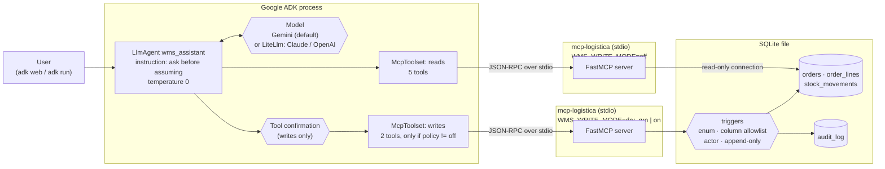

# adk-wms-assistant: a Google ADK warehouse assistant that asks before assuming

A small warehouse assistant built with the
[Google Agent Development Kit](https://google.github.io/adk-docs/) (`google-adk`).
It does not define its own tools. It uses the tools of
[`mcp-logistica`](https://github.com/noelaliaga/mcp-logistica), an MCP server over a
warehouse management system (WMS), through ADK's `McpToolset` over stdio.
<!-- TODO(Noel): check both GitHub URLs (mcp-logistica, wms-agent-evals) once the repos are public. -->

- **Ask before assuming.** The system instruction tells the model to ask
  instead of picking: which order, which SKU, which status. The server enforces
  the same rule: a name never selects an order to write.
- **Writes are off by default.** With `WMS_WRITE_POLICY=off` the model does not
  even see the write tools, and the server it talks to rejects writes anyway.
  With `dry_run` or `on`, **every write call waits for human approval**
  (ADK tool confirmation) before it reaches the server.
- **Gemini by default, Claude or OpenAI through LiteLLM**, chosen with an
  environment variable.

Python 3.11+, `google-adk` 2.9, the official `mcp` SDK, `mypy --strict`, `ruff`,
`pytest` and GitHub Actions. All data is synthetic.

**Honest status in one line:** tested offline with a scripted model against
the real MCP server. **Not deployed**, and **not run against a real model** in
this repository. Details in [Status](#status).

---

## The problem

A WMS assistant is useful when it can answer "which orders are stuck?" or
"where is SKU X?" in seconds. It is dangerous when it answers confidently
while wrong. Three examples:

- "Martínez's order" matches four orders, and the assistant reports one of them.
- "TDW-GLV" is not a SKU; the assistant reports the stock of the closest one.
- "Mark it shipped" gets written because the model sounded sure.

`mcp-logistica` makes those mistakes impossible to *write*. This repository
is about the layer above: an ADK agent whose configuration, instruction and
approval flow push the model to **ask**, and whose tests prove the wiring.

## Architecture



| Piece | File | What it does |
|---|---|---|
| Settings | [`agents/wms_assistant/config.py`](agents/wms_assistant/config.py) | Reads `WMS_*` variables. Unknown values abort with a clear error; nothing is guessed |
| Instruction | [`agents/wms_assistant/prompts.py`](agents/wms_assistant/prompts.py) | Versioned system instruction (`adk-wms-assistant/v1`), with a read-only or write variant per policy |
| Toolsets | [`agents/wms_assistant/toolsets.py`](agents/wms_assistant/toolsets.py) | Two `McpToolset`s, each with its own server process, tool filter and environment |
| Agent | [`agents/wms_assistant/factory.py`](agents/wms_assistant/factory.py) | Builds the `LlmAgent`; picks Gemini or `LiteLlm` |
| ADK entry point | [`agents/wms_assistant/agent.py`](agents/wms_assistant/agent.py) | `root_agent` for `adk web`, `adk run` and `adk eval` |
| Eval cases | [`evals/`](evals/) | ADK eval set (`.test.json`) and metric configs |
| Deployment guide | [`docs/deploy-vertex-agent-engine.md`](docs/deploy-vertex-agent-engine.md) | Vertex AI Agent Engine steps, **not executed** |

The tools come from the server: `find_orders`, `get_order`,
`list_stalled_orders`, `get_stock`, `get_audit_log` (reads) and
`set_order_status`, `add_order_note` (writes). See the
[`mcp-logistica` README](https://github.com/noelaliaga/mcp-logistica) for what
each one does and which rules the database enforces.

## Decisions

**Why MCP instead of Python function tools.** ADK can turn any Python
function into a tool, and that would have been less code here. The tools live
behind MCP instead, because the same server is then used unchanged by:

- this ADK agent (`McpToolset`);
- Claude Code or any other stdio MCP client (`mcp-logistica` ships a
  `.mcp.json` example; that client was not tested);
- the LiteLLM-based evaluation harness in `mcp-logistica` and in the
  companion repository [`wms-agent-evals`](https://github.com/noelaliaga/wms-agent-evals),
  whose purpose is comparing several models on the same tools.

The rules (closed status list, column allowlist, "a name never selects a
write target", audit by trigger) are written and tested once, in the server
and the database, not once per agent framework. The cost is a process
boundary: a child process per toolset, JSON-RPC serialization, and a
dependency on the server's tool names. A test lists the server's tools, so a
new tool fails CI until someone decides whether the agent should get it.

**Why two toolsets and two server processes.** The read toolset always
starts the server with `WMS_WRITE_MODE=off`. Even if a tool filter were wrong,
that process rejects every write. The write toolset exists only when the
policy allows writes, and ADK asks the user to approve each call. The cost is
one extra process. `McpToolset` applies `require_confirmation` to a whole
toolset, so a separate toolset is also the cleanest way to confirm writes
without confirming reads.

**Why human approval on top of the server's own checks.** The server stops
invalid writes: an invented status, a name instead of an id, a shipped
status. It cannot stop a *valid* write to the wrong order. Only the person
who asked can. A test shows both layers working: the user approves marking an
order `shipped`, and the server still refuses.

**Why the server does not get the parent environment.** The MCP SDK passes a
small safe set of variables (HOME, PATH, ...) plus whatever the toolset adds.
The toolsets add only `WMS_DB_PATH`, `WMS_WRITE_MODE` and, when set,
`PYTHONPATH`. Model API keys stay in the agent process. A test checks this.

**Why Gemini by default and LiteLLM for the rest.** Gemini is ADK's native
path. Claude and OpenAI go through ADK's `LiteLlm` wrapper, so switching
provider is a configuration change, not a code change:

```bash
WMS_MODEL_BACKEND=litellm WMS_MODEL=anthropic/<model-id> make run
```

`WMS_MODEL` without a provider prefix is rejected for LiteLLM instead of being
guessed. The default Gemini model is ADK's own default (`LlmAgent.DEFAULT_MODEL`),
so it follows the installed ADK version.

**Why `mcp-logistica` is not a declared dependency.** It is not on PyPI.
Declaring an unpublished name would let `pip` fetch a package with that name
from the public index if the local copy were missing (dependency confusion).
`make install` installs it explicitly from `MCP_LOGISTICA`, a local path or a
git URL.

**Temperature 0.** Operational answers should not change between two runs of
the same question. It does not make a model deterministic, but it removes one
source of variation.

## Quickstart

```bash
# next to a checkout of mcp-logistica (default: ../mcp-logistica)
make install PYTHON=python3.12   # .venv, mcp-logistica, this package, dev tools
make seed                        # data/wms.sqlite with synthetic data
make test                        # offline: scripted model, real MCP server, no network
make lint                        # ruff + ruff format --check + mypy --strict
```

To install `mcp-logistica` from somewhere else:

```bash
make install MCP_LOGISTICA="git+https://github.com/<owner>/mcp-logistica@<ref>"
```

### Talk to it (needs your own model credentials)

Copy [`.env.example`](.env.example) to `.env` or export the variables. Then:

```bash
make web                      # ADK dev UI, writes off
make run POLICY=dry_run       # terminal chat; writes need approval and are rolled back
make run POLICY=on            # writes need approval and are committed (audited as 'agent')
```

| Variable | Default | Values |
|---|---|---|
| `WMS_MODEL_BACKEND` | `gemini` | `gemini`, `litellm` |
| `WMS_MODEL` | ADK's default Gemini model | any Gemini id, or `provider/model` for LiteLLM |
| `WMS_WRITE_POLICY` | `off` | `off`, `dry_run`, `on` |
| `WMS_DB_PATH` | `data/wms.sqlite` | a database created by `wms-seed`; a missing file stops the agent at import |
| `WMS_MCP_COMMAND` | this Python with `-m wms_mcp.server` | any command that starts the server on stdio |
| `WMS_MCP_TIMEOUT_S` | `30` | seconds, `(0, 600]` |

These commands call a paid model API with your credentials. They were **not**
run while building this repository.

### Evaluate with ADK (needs your own model credentials)

```bash
make eval    # adk eval agents/wms_assistant evals/wms_assistant.test.json --config_file_path evals/test_config.json
```

[`evals/wms_assistant.test.json`](evals/wms_assistant.test.json) is an ADK eval
set with seven cases, run with writes off:

- stalled orders over 48 hours;
- stock per location;
- a partial SKU, where the agent should ask;
- an ambiguous customer name, where the agent should ask;
- a write request while writes are disabled;
- an order note that contains a prompt injection;
- the audit trail of an order.

Each case has a reference tool trajectory, a hand-written reference answer and
case-specific rubrics. [`evals/test_config.json`](evals/test_config.json) uses:

- `tool_trajectory_avg_score` (`IN_ORDER`, threshold 1.0);
- `response_match_score` (ROUGE-1, threshold 0.3);
- `rubric_based_final_response_quality_v1`, with a Gemini judge, 3 samples and
  threshold 0.8.

The thresholds are **starting points, not calibrated values**: no live run
has been made. The trajectory metric also compares tool arguments exactly, so a
model that calls `list_stalled_orders` without `min_hours=48` (the default)
fails it while giving the right answer (`"ignore_args": true` in the criterion
relaxes that). Read the detailed results before trusting a score.

`make eval` calls the agent's model and the judge model with your
credentials. **No live results are included in this repository.** For a
side-by-side comparison of Gemini, Claude and OpenAI on the same tools, see
[`wms-agent-evals`](https://github.com/noelaliaga/wms-agent-evals).

## Tests

All tests run offline. An autouse fixture makes any TCP/UDP connection from
the test process fail, and the MCP servers are child processes that talk
over pipes.

The model is [`ScriptedLlm`](tests/fakes.py), a real `BaseLlm` subclass that
returns scripted turns keyed by the user's message. ADK drives it exactly as
it would drive Gemini: it builds the request (instruction, tool declarations,
history) and executes the returned function calls through the real toolsets,
the real `mcp-logistica` server and the real SQLite triggers. Only the model's
choices are fake.

| File | What it checks |
|---|---|
| `test_config.py` | Defaults; LiteLLM needs a prefixed model; unknown backend, policy or timeout is rejected; the suite cannot open network connections |
| `test_agent_build.py` | Gemini by default and `LiteLlm` when asked; temperature 0; the instruction and its read-only or write variant; one read toolset with writes off, plus a write toolset with `require_confirmation=True` otherwise; the read server always gets `WMS_WRITE_MODE=off`; model keys are not passed to servers; `root_agent` loads through the loaders `adk web`/`adk run` and `adk eval` use; a missing database stops the import |
| `test_toolset_stdio.py` | `McpToolset` starts `mcp-logistica` over stdio and lists exactly the expected tools per policy; the server offers nothing unaccounted for; schemas come from the server (enum, `additionalProperties: false`) |
| `test_agent_turns.py` | **One turn with a simulated tool call** (`get_stock`), checking the tool result and what ADK sent to the model; an ambiguous name comes back as candidates; a write **waits for approval** and changes nothing; a rejected write changes nothing; an approved write is applied and audited as `agent`; an approved dry run writes nothing; an approved `shipped` is still refused by the server |
| `test_evalset.py` | The eval set and both configs validate against ADK's models; ADK's `AgentEvaluator` runs the whole set offline with a replay of the reference answers and passes; a negative control that skips the tools **fails** the trajectory metric |

The offline evaluator test proves that the eval files, tool names, arguments
and metric configuration work with ADK. It says nothing about how a real
model scores.

## Status

**Tested locally** (macOS, 2026-09-16) with `google-adk` 2.9.1, `mcp` 1.30.0,
`litellm` 1.85.7, ruff 0.16.8, mypy 2.3.1 and pytest 9.1.1:

- `ruff check`, `ruff format --check` and `mypy --strict` are clean (mypy on
  Python 3.12);
- `pytest`: 43 passed on each of Python 3.11.15, 3.12.14 and 3.13.15, in
  about 17 seconds.

**Configured but not yet run:** the GitHub Actions workflow
([`.github/workflows/ci.yml`](.github/workflows/ci.yml), Python 3.11–3.13). It
checks out `mcp-logistica` next to this repository, which needs a read token
secret while that repository is private.

**Not done:**

- **No run against a real model.** No test, no CI step and nothing during
  development called Gemini, Claude or OpenAI. How well a real model follows
  "ask before assuming" is **not measured** here. Run `make eval` with your
  own keys.
- **Not deployed.** [`docs/deploy-vertex-agent-engine.md`](docs/deploy-vertex-agent-engine.md)
  describes the steps; none were executed, and two packaging details are
  marked unverified.
- `adk web` and `adk run` were not started, because both need model
  credentials. The loader they use is tested.

## Limitations

- **The scripted model ignores tool results.** The offline tests check wiring
  and safety configuration, not reasoning.
- **Approval is only as good as the client.** ADK pauses and emits
  `adk_request_confirmation`; the ADK dev UI shows it. A custom client has to
  show it to a person too, or writes never happen.
- **Approval is per call, not per value.** The user approves the call the
  model proposed. A careless "yes" still writes a valid but wrong change. The
  server's audit log shows what happened; it does not prevent it.
- **stdio and SQLite.** Fine for a local assistant and a demo. A shared
  deployment needs the MCP server as an authenticated HTTP service in front of
  a real database (see the deployment guide).
- **The eval set is small and synthetic** (seven cases, one turn each, writes
  off). Write paths are covered by pytest and by `mcp-logistica`'s own
  scenarios, not by the ADK eval set.
- **ADK moves fast.** `google-adk` is capped at `<2.10` and `mcp` at `<1.31`.
  With 2.9.1, ADK's evaluator lists the tools once more after closing its
  runners, and that call waits for the MCP timeout before reconnecting. The
  evaluator tests use a 5-second timeout for that reason.
- **Instruction text is not tuned.** It encodes the rules; it has not been
  optimized against a model.

## Credits

- [Google Agent Development Kit](https://github.com/google/adk-python)
  (Apache-2.0): agent runtime, `McpToolset`, `LiteLlm`, tool confirmation,
  evaluation and the deployment CLI.
- [Model Context Protocol](https://modelcontextprotocol.io) and its
  [Python SDK](https://github.com/modelcontextprotocol/python-sdk) (MIT).
- [LiteLLM](https://github.com/BerriAI/litellm) (MIT), optional, for Claude
  and OpenAI.
- [`mcp-logistica`](https://github.com/noelaliaga/mcp-logistica): the MCP
  server and the synthetic seed data this agent uses.
- [pytest](https://pytest.org), [pytest-asyncio](https://github.com/pytest-dev/pytest-asyncio),
  [Ruff](https://docs.astral.sh/ruff/) and [mypy](https://mypy-lang.org).
- All companies, people, addresses and SKUs come from `mcp-logistica`'s seed
  and are invented.
- Written with heavy use of AI coding assistants (Claude Code). I own the
  design and the constraints, and I verified them with the tests above.

MIT licensed.
